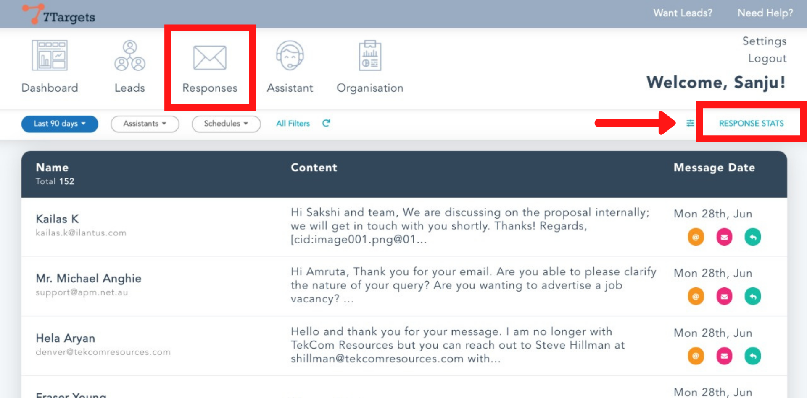
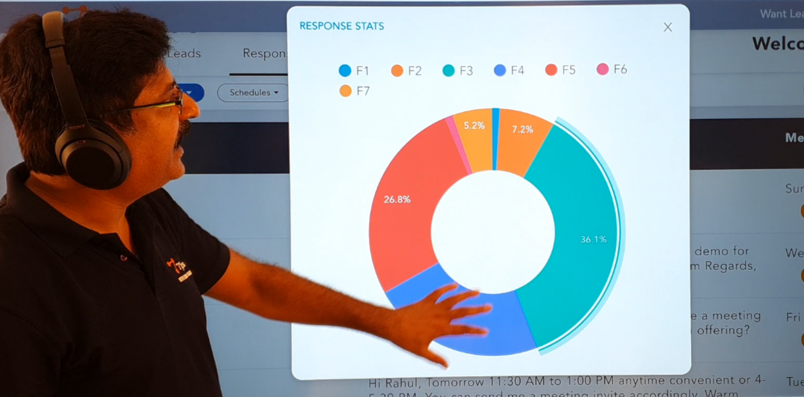
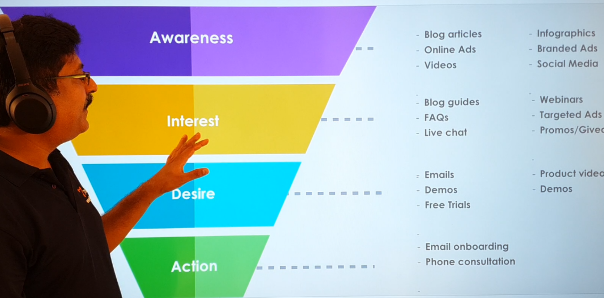
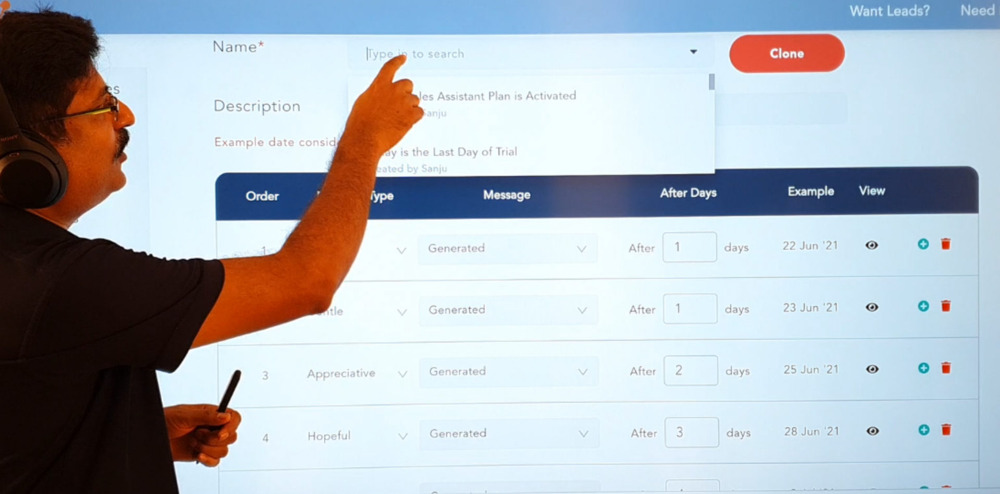

A regular follow-up always gives customers a chance to be heard and engage effectively. Follow-ups can be a great source to ask customers, “What they want/expect next.” Customers usually want a medium to get in touch with the company. Therefore, the follow-up system enhances this communication.

A survey of National Sales executive association has shown 

48% of salespeople never follow up with a prospect.
25% of salespeople make a second contact and stop.
12% of salespeople only make three contacts and stop.
Only 10% of salespeople make more than three contacts.
2% of sales are made on the first contact.
3% of sales are made on the second contact.
5% of sales are made on the third contact.
10% of sales are made on the fourth contact.
80% of sales are made on the fifth to twelfth contact.

To check the response statics on 7Targets 

Go to 'Responses' and click on 'RESPONSE STATS'

Here you'll see the graph of follow-ups

The orange color highlights the second follow-up which is 7.2%
The light blue color highlights the third follow-up that is 36.1%
The Ocean blue color highlights the fourth follow-up that is 22.7%
The red color highlights the fifth follow-up that is 26.8%
The Pink color highlights the sixth followup
The yellow color highlights the seventh follow-up that is 5.2%

The above data is of one year.

Different stages of the funnel require different followup 

The awareness stage requires a different approach to make your customer aware that what you're offering. Awareness of products can be created by blog articles, Online Ads, and videos.

Interest stage is when somebody likes the company's services, it requires separate setup followups such as blog guides, frequently asked questions, and live chat if necessary.

The desire stage comes after the consumer is interested in a product or service, then the goal is to make consumers desire it, moving their mindset from 'I like it' to 'I want it'.

The action stage is when the consumer is convinced by your service. This stage requires certain follow-ups such as email onboarding and phone consultation.

With 7Targets these stages can be implemented easily.

You can actually search and see the different stages of your email follow-ups.

By doing this you can have different sets of messages at different stages to make sure that your approach to sales at several stages is in a proper process. This will reduce the chances of miss out on who's executing the process.

 Followups at different stages require a different approach. Emails also follow their own journey, going through different stages. Below written is the complete journey of an email and the importance of follow-ups.

Hope this helps you. You can drop an email to info@7targets.com if any questions.
