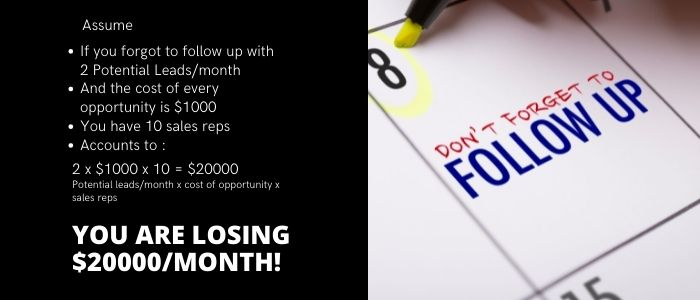

## Video on 'Why are Recruitment companies loving AI-POWERED sales assistants?'

    <iframe src="https://www.youtube.com/embed/e03knBau3c4" height="380" width="560" 
    allow="autoplay; encrypted-media"
    frameborder="0">
    </iframe>

## Recruitment companies that are using AI sales assistants:

Here are some of the big and small companies that are already using AI for sales.

 

## Can you use AI sales assistants for your company?

By looking at the following companies, you can decide if you can use the sales assistants or not!

**Kelly Services**, Inc. is an American office staffing company that operates globally. The company places employees at all levels in various sectors, including financial services, information technology, and law.

**Talent Corner** is a Leading Recruitment Agency And Placement Consultants in India. Talent Corner is One of the best Placement Consultancy and Recruitment.

**Green Recruitment Solutions** are an established firm of expert recruiters specializing in recruiting for the green industries worldwide.	

**Protask** is an 11 years old company.

**BHS Staffing Solutions** is as small as [3 people company which went to become 20 people company](https://youtu.be/uowz6MMemo0) in just a few months. 

So, we can safely say that regardless of the size of the company, number of years in business, number of employees, you can always use AI sales assistants in your sales department.

## How do the recruitment companies make their money?

We all know that incorporating AI in sales will definitely give some good results but is it affordable? How can it benefit my business? These are the questions that come along with artificial intelligence.

To find the answer, let's start with how recruitment agencies earn their profit.

 

As you can see, it is mentioned that recruitment agencies charge between 15 to 20% of a candidate’s first annual salary. And for senior positions, it can be as high as 30%. These senior positions are generally difficult to fill.

The fees may vary in different countries for different positions. We can say that the recruitment agencies charge between 5% to 30% of the candidate’s first annual salary considering the varying percentages of different countries. In India, for juniors, the fee is around 8.33%.

But to earn these profits, what marketing strategies do these agencies follow to acquire the leads?

## What do the salespeople do?

 

In the funnel of marketing, the first step is awareness. Here is where the leads come to know about your product. Most of the time, junior salespeople are given the job of reaching out to the leads, telling them about the product, nurturing them with relevant information, success stories, etc.

It is often observed that the drop rate at the awareness stage is around 80%. This can be because of a lack of experience, dedication, sincerity, as you have to be in touch with each lead and follow up with them at proper intervals. It can be very tiresome as you receive 70 to 80 emails daily. Tracking these emails and replying to all of them can be very difficult.

When someone opens an email or clicks on the link present in the email, it shows that the lead is interested. This is the second stage. Generally, you get 8 - 10% of the open rate here. It means that among the 1000 leads, only 100 or even fewer leads are opening the emails. And if these 100 leads aren’t followed up properly, you will again lose many opportunities altogether.

Someone showing interest doesn’t mean he is going to convert. So you need to follow up with them continuously.

## Why do salespeople get a low open rate?

The opening of an email majorly depends on the subject line. If your emails do not have good subject lines, there are very few possibilities of getting high open rates. And to write an ideal subject line, there are many tips available which should be followed strictly. But when I say many tips available, there are a huge number of them out there, which can actually help give high open rates.

 

But it is very difficult for a human to remember all of them and apply them while writing subject lines. So even if you think of reading them all and apply, it will take a major part of your time of writing emails.

Not writing good subject lines is the biggest reason for low open rates. One has to come up with good subject lines so that the receiver opens the email and eventually generates interest!

## How good are Salespeople at following up?

The above statistics say 48% of salespeople never follow up with the prospect. Whereas 80% of sales are made on the fifth to twelfth contact, but only 10% of salespeople follow up more than three times.

Only the diligent, motivated, and disciplined salespeople will not account for the above loss of $20000. These are generally the sales reps who follow up with the leads three or more than three times.

Here is where AI sales assistants come in for the discipline of follow-up.

## What do the AI sales assistant do?

AI sales assistants can read the emails, understand them, and respond to the most generic emails. It is a machine learning model that continuously learns from user behavior and strictly follows every tip. 

Below are a few basic rules of writing emails followed by the AI sales assistant for every email.

Because of which assistants always give an open rate (Engaged) minimum of 25%.

Also, you don’t need to figure out the leads you need to ignore. Instead, the assistant filters out the interested leads and your lot of time is saved! In below image, Assistant is asking to ignore 11514 (67%) leads.

All you have to do is assign leads to the assistant, and she nurtures them until leads ask for a meeting. And so you can only focus on these potential customers.

## Is AI sales assistant affordable? When will I get my money back?

The plan for a quarter is $600 and can follow up with 1200 leads.

Assume you get just a 10% open rate, not even 25%, which is the minimum for the AI sales assistant.

10% response rate.

And if only one position closed with a $50k annual salary and a 5% commission (which varies from 5 to 30%).

You earn $2500!

With just one position closed within 3 months, you can pay for the entire year’s plan.

And do note that we are considering the minimum numbers here. So along with paying for itself, the assistant gives you good profit by helping you in reducing the number of dropped leads due to poor follow-up.

## How are people using the AI sales assistant?

Connecting with NEW HR heads of various companies at scale to get empanelled, increase client base, and have candidates sent to multiple clients.

Activating EXISTING customers who have gone stale and are no longer providing new positions actively. This is the lowest hanging fruit where you see ‘instant results’ using AI Assistants.

## Other amazing features of the AI sales assistant software

To know more about our AI sales assistant features, you can have a quick read: [How does AI help in converting more leads into HOT leads?](https://blog.7targets.ai/How-does-AI-help-in-converting-more-leads-into-HOT-leads/)

To sum up, with an AI sales assistant, 
- you get filtered leads that are already interested, 
- the assistant does all the initial communication till the lead asks for a meeting 
- you don’t have to worry about the subject lines and email construction
- assistant follows up at proper intervals and with relevant success stories with each lead
- and many more

As you saw that already many recruitment companies, big, small, old, new, have incorporated AI in sales and are loving it, do [give it a try for 7 days for free](https://7targets.ai/sign-up.html?utm_medium=rcrtmnt-companies-love-ai&utm_source=7tsblogs) and get a feel of having an AI sales assistant in your sales department.
