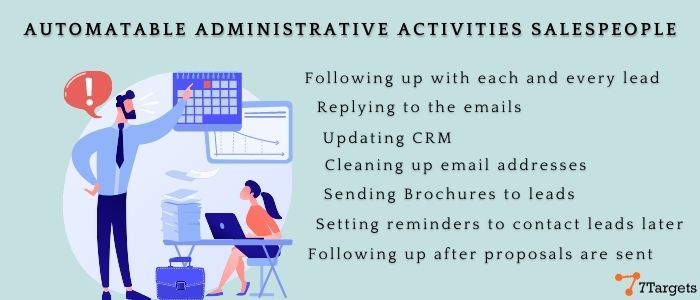
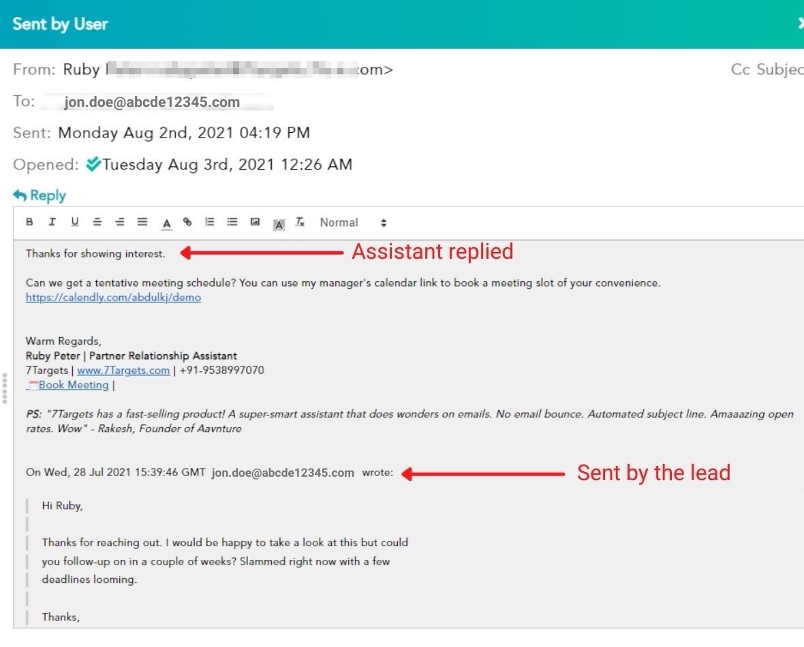
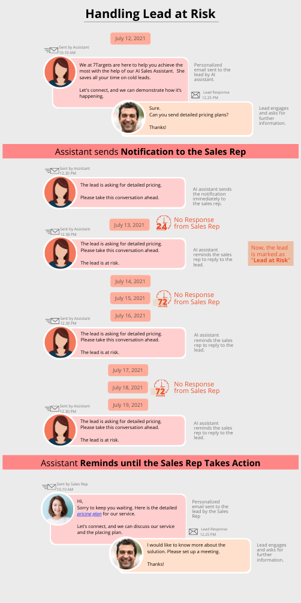

I will share my experience with the AI sales assistant in my sales department, and then we can conclude if you need one!

Initially, my sales team used to do all the work manually.

 

And because of all this (above) workload,  the main focus of ‘selling’ or ‘closing the deal’ was not getting enough time.

Focus on researching the lead’s company, qualifying the lead, learning more about lead from LinkedIn, preparing for the meeting, etc. got less time.

But does that mean we should only focus on ‘selling’ or ‘closing the deals’?

Well, yes and no!!

The administrative work is equally important to create a healthy pipeline to eventually score a meeting with a lead.

What if almost all the administrative work is taken care of by someone else?

We had all the time to work on closing as many deals as possible!

 

But what really used to happen before AI sales assistants came?

Even though putting maximum human time in administrative work, a study says that:

When the lead opens an email or clicks on the link present in the email, it shows that the LEAD IS INTERESTED.

This is the 'GENERATING INTEREST' stage.

Generally, you get 8 - 10% of the open rate here. And if these leads aren’t followed up properly, you will again lose many opportunities.

Do you think someone showing interest MEANS HE IS GOING TO CONVERT?

No, you need to follow up with them continuously.

So let's see how AI sales assistants are preventing these leads from falling through the cracks.

Here is a list of things AI sales assistants are capable of that spares you from almost all the administrative work!

## 1. Automated responses to conversations

AI assistants spare you from replying to all the administrative responses you get from the leads.

To learn more about the automated responses, here is a quick read on [how Assistant Reads Emails and Responds Automatically.](https://7targets.ai/blog/how-assistant-reads-emails-and-responds-automatically/)

## 2. SUPER SMART usage of out-of-office emails, use good phone numbers from ooo (out of office) emails instead of boardline call numbers

1. AI Assistants automatically add new leads from ooo emails. Many times you will find that email addresses of bosses or juniors are mentioned in ooo emails.

2. AI Assistants will also ask you to confirm the name of the new lead from ooo email. Assistant will smartly default the name to firstname.lastname@abc.com if the email address pattern contains a dot in it.

3. Phone numbers from each email are extracted and the lead record is enriched with this information.
 
4. Emails are automatically rescheduled to a later date when the person is back in the office.

## 3. Automated and Intelligent Email Cleanup

How often do you clean up your lead list?

Only when it’s bought? Or only when you get a high bounce rate?

The Assistants do that periodically without your intervention!

Removing email addresses like info@, hello@, hr@, sales@ marketing@, etc., is easily done by assistants, so you don't end up emailing generic email boxes.

<table style="background-color: white;" border="0"  >
 <tr>
    <td class="not-on-mobile"></td>
    <td style="padding: 30px;"> <h5>Get Your Own AI Assistant to Drive Your Sales Pipeline and <b>Double Your Meetings</b></h5>
    - Gets you more <b>engaged & converted leads</b> 
    - Creates a <b>healthy sales pipeline</b> for you 
    - Gets you <b>double response</b> with targeted nurturing 
     
    </td>
 </tr>
</table> 
<table style="background-color: white;margin-bottom: 30px;" border="0"  >
 <tr>
    
    
    
 </tr>
</table>

## 4. Write different emails each time (Dynamically generated emails)

The assistants create a different email per person using Natural language generation, simulating human emails. 
This keeps you away from spamming issues as far as possible and takes the open rate through the roof.

WATCH the almost-magical way in which **Assistant simulates a HUMAN** way of writing different emails each time!

## 5.  Subject line expertise. With AI Scores for each subject line

The importance of subject lines is missed by most. 
Just to be VERY clear:

Subject lines DECIDE how many leads are going to OPEN your email. 

Think about it. 

If your email is NOT opened, the body of the email is not even seen. 

Most people spend a lot of time on EMAIL BODY but ignore subject lines. 

Getting the subject line right DEFINES the FLOW OF LEADS into your funnel. 

In a way, it’s the TOP of the Funnel (TOFU).

AI world has finally made it easy to not remember all the rules about subject lines. 

Subject lines can now be automatically generated based on machine learning models.

Spammy words like MONEY, FREE, etc. are automatically removed from subject line creation.

## 6. Prevent lead drops and lead leaks. *Track each thread between the salesperson and the Lead.*

Management generally will push each sales rep in daily sync-up meetings to ensure things move forward. 

How many times have you forgotten to respond to a lead? 
Sometimes leads forget to respond, even if the salesperson has responded to the lead. 

Sales Reps forget to follow up on such leads because they had *already responded* to the lead.

- **If Lead drops the ball, the assistant will remind**

- **If your SalesRep drops the ball, the assistant will help**

Here, the AI Assistants smartly pick up such threads and automatically start reminding the lead to respond.

## 7. Specific vertical focused, segment-wise nurturing

This helps B2B companies in a BIG way to actually nurture each person with focus. Instead of a 'generic intro email broadcast approach'.

## 8. B2B webinar announcement broadcasting

AI Assistants also helps to broadcast your email invitations to all existing contacts who have not deactivated or unsubscribed you.
 
 
**To sum up, I would say,** with an AI sales assistant,

- you get filtered leads that are already interested,
- the assistant does all the initial communication till the lead asks for a meeting
- you don’t have to worry about the subject lines and email construction
- assistant follows up at proper intervals and with relevant success stories with each lead
- and many more

 

So, introducing an AI assistant into your sales pipeline and handing over the responsibility of all the initial conversations to the AI Assistant - till the leads are classified as HOT - can save you a lot of time.

This time can be directed towards closing deals.

It spares you from:

- replying to all the administrative responses, 

- creates a healthy sales pipeline, 

- you can always make decisions based on accurate metrics, 

- and most importantly, never let any of your potential customers fall through the cracks, ever!

You can find these and many more features in the **7Targets AI sales assistant**. Feel free to sign-up here for for [14 days for free](https://7targets.ai/sign-up.html?utm_medium=what-is-ai-assistant&utm_source=7tsblogs) and give it a try and experience how an AI assistant can save your valuable time!

    <iframe src="https://www.youtube.com/embed/uowz6MMemo0" height="380" width="560" 
    allow="autoplay; encrypted-media"
    frameborder="0">
    </iframe>

