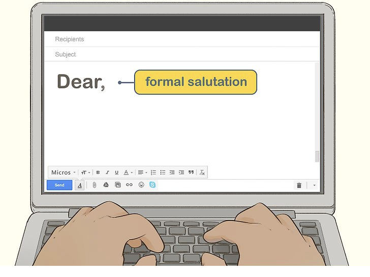

We will create a ML model to help identify and remove the salutation line from the actual email body. Running the model on [AWS Lambda](https://aws.amazon.com/lambda/) helps keep our AWS bill in control.

## Why?

There are many tools out there which need to feed the email body to some ML model for some analysis or for further processing. But to them the first line which is in 40% of cases a salutation or a greeting line is a noise. 

- The model we are creating, will help identify and remove the salutation line from the actual email body.
- Running the model in Lambda helps keep our AWS bill in control

# Lets get started...!

We will input an email body to the model and it should return `True` if the first line of the email body is greeting else it should return `False`

## Dataset

For [7Targets](https://7targets.ai), we wanted to create a model that would remove the salutation line for further processing of emails. To create an ML model you need a dataset on which the model is trained. For our case, we needed a set of emails as a dataset. In our case we used emails we have. We manually classified the emails and marked them if they contained greetings.

## Preprocessing

To create feature vectors for the email, we first had to preprocess the data. Then removed the empty lines from every email and then selected the first line for further processing. For the sake of simplicity we will always check if the first line of the email is a salutation or not.

## Feature Vector Generation

Now from the first line of the email that I got from the above step, we had to generate the feature vectors which are then fed to the model for training. We then wrote the code to convert the first line of email into the 3 features described as below:

- **Salutation Score :** We first created a list of commonly used salutations in the email such as `dear, hello, hi, respected, good morning, etc`. Then, found out the Levenshtein similarity between the first line and all of the above salutations. Finally, gave the score to the sentence as maximum of all the similarity.
- **Uppercase Score :** Salutations generally starts with uppercase letter. For example, `Dear Tanmay, Respected Sir, etc`. So we gave the sentence uppercase score according to the total number of letters starting with uppercase alphabet.
- **Sentence Length Score :** Usually salutations are shorter in length than most of the other sentences in the email. They are mostly 2-4 words in the whole sentence. We gave the sentence length score accordingly. Longer sentence gets less score and shorter sentence gets more score.

## Model Training

We first split the data into sets of training and testing data with a ratio of 3:1 and chose **Random Forest Classifier** as the classifier for the project. Trained the model with training data and then tested the model and got accuracy to be 97%. The accuracy was higher than I had expected. Finally, we saved the model into a pickle file using joblib for later use.

# How did we use the model?

We had to run real time inference of the data on AWS Lambda, because we use serverless technology a lot. We first created the [AWS Lambda Layer](https://docs.aws.amazon.com/lambda/latest/dg/configuration-layers.html) from the [scikit learn](https://scikit-learn.org/) library and used the AWS prebuilt [Numpy](http://www.numpy.org/) layer. Wrote the inference code and pushed the pickle file of the model into the Lambda. It worked like a charm and we are now using it in production.

# Summing up!

In this article, I have demonstrated the simplest workflow required to develop a machine learning model used to identify salutations in the email. 

Though, there are few more improvements that would be required in this model. Like, if there is no newline between the salutation and the email body then the model would not work well. Which we will discuss for a later time. 

Hit me up on my [email](mailto:hello@tanmaysinghal.dev) if you have any questions.

Thanks for reading!