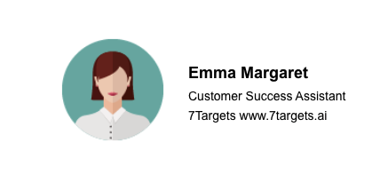

An email signature is a crucial part of an email. One always questions, How should a professional email signature look like, Which signatures work, What do I write or not write in the signature?

One would have seen emails where the signature takes up half of the screen size on mobile. Does that work? Especially when you are writing to lead or prospect, what should be part of the signature?

We analyzed over 1 million emails that had about a 5+% response rate. All emails were for *cold leads*. Most of the prospects fell into the SMB category. Target geographies primarily included Australia, India, Germany, Dubai/UAE, UK, Israel, Romania, Ukraine, US, Canada, Brazil, and Peru.

We have the below observations.

## Keeping it short and simple(KISS)

Most email senders kept the signature simple. Name, Title, Phone number, Company name, and URL are suitable to represent you and your company. Simple text, not taking too much screen space. It will show up properly on mobiles as well.
We have chosen the below default signature format for AI Assistants in 7Targets. It has worked well for us till now for more than two years. Some people change it to use color and fonts. 

[]

## Your Picture

We have also seen that a picture of a person can put a face to name. A small passport-sized picture on the left-hand side followed by a thin vertical line to its right, and then details like name, company to the right of the image. We will be analyzing the difference a picture makes to crucial metrics like click-through rate and response rate. If you are interested in that analysis, drop an email to info@7targets.com, and we will send it to you.

[]

## Large Enterprise look: Confidentiality Clause

After all the email thefts and privacy issues, you might have seen the minor footnotes saying something like **Contents are Confidential**. It is meant to be used only for the purpose it was sent for. If you are not Sanju, please delete the email. Delete it from Recycle bin too, etc.

Such footnotes at the bottom of the emails generally are perceived to be coming from large enterprises. Based on your needs, you can decide if you like to add this to your signature.

Many corporate email servers are configured to add this footnote to every outgoing email automatically.

**Do not print this email unless needed. Save the earth.**

An average American receives 50 to 80 emails a day today. We think we are past the era of printing unnecessary emails today. There will be some exceptions, but the percentage is still not what it used to be a decade ago. One can still share other more relevant green initiatives.

## PS: Share some relevant knowledge link

Sharing some relevant information link as **PS:** just below the signature has helped us and our customers nurture their leads. If you can add testimonials or case studies, or success stories that can be valuable to prospects, it can help make the email sharper. The key is to keep it as a one-liner, provide something relevant that has value for the receiver. Such **PS:** line helps to grab the attention and drive engagement.

If the core signature is short and straightforward, this PS part of the email is easily visible. You may also want to ensure that each email sent to your lead/prospect provides different one-liners as **PS**. 7Targets AI Sales Assistant [Nurture Table concepts](https://help.7targets.ai/getting-responses/assistant-nurturing/) provide this vital function to ensure that users do not forget to send relevant success stories to prospects. Your success is the highest motivator for someone else to respond to you.

[Nurturing and Converting leads using 7Targets AI Sales Assistant](https://blog.7targets.ai/nurturing-and-converting-leads-like-never-before-use-7targets-ai-sales-assistant/) 

## Limit the information

Not going overboard with the information or images in the signature (or below the signature) is essential. If you think this information needs to be shared, consider making it part of the subsequent follow-up emails. 

Make social handles and links part of the signature if you believe you have a good presence there. Think twice before putting big images as part of the signature.

## Provide some actionable links

If a prospect wants to meet you, having a handy Book a Meeting link in your signature may seem to help. But in the 1.5 million emails analyzed, we have rarely seen someone click **book a meeting** link.

We are now trying **WhatsApp Me** actionable link in the signature. We do not have conclusive data to recommend this one way or other firmly.

[]

You can try it and let us know the % times it worked for you.

## Conclusion

Keeping it short and simple (KISS) seems to have worked till now. Having different information bytes in **PS:** also has seen good click through rates. 

Hope this information helps you to have a well balanced signature.