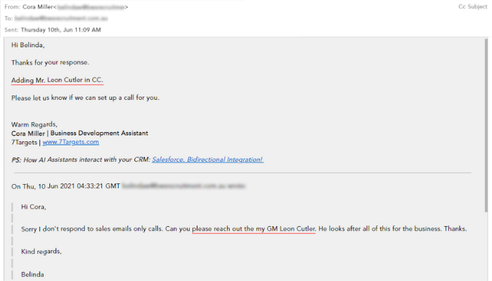

Salespeople write several emails every day. And the responses from them can be easily categorized. Apart from the usual unsubscribe, send brochure, let’s meet emails, you will also see the occasional ‘contact my colleague’ email.

When you get a ‘contact another person’ email, there is always a question. Should you include the person referred to in the next email or not. Should you start a new conversation thread with the contact provided? 
 
So let us decide what should be done when we receive such responses with a real example.
 
Here if you look at the below email thread started by Cora. Belinda, the lead, responded that she is not the right person. She asked Cora to follow up with Leon, GM. To which Cora, a salesperson, copied the GM along with Belinda in the email chain. 
 

 
Do you think Cora should have copied Belinda in the email to Leon when she referred Leon as the right person to go to? What do you think? 
 
## Here is what we think:
 
When Belinda provided a potential reference (Leon), Cora had the following choices: 
 
1. Start a new email thread with Leon as a separate lead without mentioning Belinda.
1. Start a new thread with Leon mentioning Belinda as a reference but not copying Belinda. 
1. Copy Leon in the same email that Belinda sent. 
 
These are the three main choices.
 
If you **choose 1**, i.e., Start a new email thread with Leon as a separate lead, without mentioning Belinda, then getting a response is less likely. It’s as good as a cold email.
 
Hence we rule out 1. 
 
If you **choose 2**, i.e., Start a new thread with Leon mentioning Belinda as a reference but not copying Belinda. Leon knows that Belinda referred and will most likely proceed to read Cora’s emails. As it creates trust, that someone I know has referred this.
 
Suppose you **choose 3**, i.e., Copy Leon in the same email that Belinda sent. It’s like putting Belinda on the spot. Think about it. If Belinda had to copy Leon, she could have copied Leon on her own as well. But when Belinda does not copy Leon on her own but still shares Leon’s email id, she is basically saying that you continue the conversation directly with Leon and don’t copy me.
 
Hence what we see in the above thread, Cora copied Leon in the same email, which is not a recommended practice because you may even burn a contact like Belinda when you copy her.
 
The **safest way** to proceed here is to start a new thread with Leon by letting her know that Belinda had referred her, but **do not copy Belinda**.
 
## Conclusion
 
To avoid such mistakes, you must always pause and check what the lead is trying to say regarding the reference contact.
 
If the lead mentions he or she is not the right person and refers to another person, you should not copy the lead’s email address in the new email thread to start with the referred person. But in this new email thread, you must mention who provided the right person’s contact as a reference.
And if the lead wants to add someone to the email conversation, there are high chances that the lead himself will add, and you will not be asked to add them.
 
In [7Targets AI sales assistant](https://7targets.ai/index.html?utm_medium=copy-reference&utm_source=blog), you can start following up with the provided reference in just one click. Not only this but the AI sales assistant can read, understand, and also reply to the most generic emails received from the leads.
 
Hope this information helps you to decide whether to copy the person who has provided the reference in the emails or not!
 
