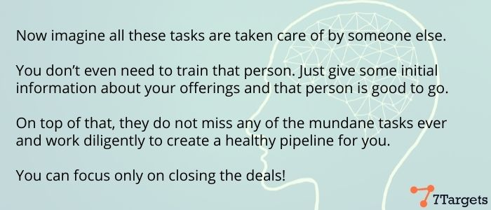

We all know, Sales is an art. Although this is an art, there are quite a few mechanical, repetitive aspects to sales. Even though the tasks are repetitive, missing them can significantly affect the sales pipeline. For example, if you do not regularly clean up your email list, your account will get blocked, and your outreach will be severely affected.

Here are some of the top repetitive and mandatory tasks that are significant to keep your sales pipeline healthy: 

1. Continuous follow-ups for getting meetings
1. Follow-Ups after sending proposals
1. Cleaning up email addresses
1. Retargeting periodically
1. Sending brochures on time (within 5 mins if possible)
1. Updating CRMs with reminder tasks
1. Reminders before customer meetings
1. Reminders for calling certain people 
1. Reminders for connecting on LinkedIn to complete daily new connections
1. Periodic enablement of new sales to latest marketing material when they contact leads
1. Navigating around spam issues
1. Fixing blocked accounts issues due to bounce rates

Given that everyone is busy and more focused on closing the deals, people drop some of these tasks, leading to the following problems.

1. High Spam rates
1. Lower network growth
1. Lead leaks
1. Poor Sales pipeline
1. Time wasted in repetitive training of new people
1. Unutilized marketing material

 

Well, that person is an AI sales assistant! Many companies are taking initiatives to launch AI in sales. Let’s directly look into some of the best features these AI sales assistant software have today.

## 1. Automated responses to conversations

The AI assistants are capable of responding to conversations if it is not moving forward. They can read, understand and respond accordingly to the most repetitive and generic emails received from the leads. 

To learn more about the automated responses, here is a quick read on [how Assistant Reads Emails and Responds Automatically.](https://7targets.ai/blog/how-assistant-reads-emails-and-responds-automatically/)

## 2. Automated Cleanup

Before you start outbound, you need to clean up your database. Assistants do that automatically. You do not have to tell them at what interval they should clean up. This saves you from blocking your account.

## 3. Deep Intelligent cleanup

Removing email addresses like info@, hello@, hr@, sales@ marketing@, etc., is easily done by assistants, so you don't end up emailing generic email boxes.

## 4. Prevent emailing existing customers

Many B2B companies will outsource their marketing to someone who ends up emailing existing customers, making everyone angry and frustrated. This is a BIG setback for companies. Most are not careful. Nobody can monitor each and every email going out. 

AI Assistants have a country-specific exclusion list and a global exclusion list. Assistants can automatically prevent all emails from going to an entire domain, or they can prevent anyone from mistakenly sending emails to a specific email address at a customer site. 

Assistants can prevent many 'bad days'. Even when new salespersons and marketing SDRs join a team, they won't send emails to existing customers mistakenly. 

## 5. Template-based emails Vs Dynamically generated emails. And the impact on spam

Template-based emailing software results in spam since you end up sending the same template to many people simultaneously. The AI Assistants create a different email per person using Natural language generation, simulating human emails. This keeps you away from spamming issues as far as possible. And takes the open rate through the roof. 

## 6. Subject line expertise. With AI Scores for each subject line
 

Not just email bodies, but subject lines are also automatically generated based on their machine learning models without using spammy words like money or free, etc. 

## 7. Coordination between salesperson and Lead to prevent lead conversation drops and lead leaks

Coordination between prospects and sales reps is very important. Management generally will pish each sales rep in daily sync-up meetings to ensure things move forward. You might have seen situations where leads forget to respond, even if the salesperson has responded to a given lead. Sales Reps forget to follow up on such leads because they had already responded to the lead. Here, the AI Assistants smartly pick up such threads and automatically start reminding the lead to respond. 

## 8. Prevent warm leads from getting into a risky situation of getting cold again

If a salesperson gets a question from a lead and does not respond within 24 hours, the assistant will remind the salesperson to follow up. We are all busy. And are interrupted again and again. Here, the AI Assistants help us not to drop the ball. 

<table style="background-color: white" border="0"  >
 <tr >
    <td class="not-on-mobile" ></td>
    <td style="padding-left: 15px;"> <h5>Get Your Own AI Assistant to Drive Your Sales Pipeline and <b>Double Your Meetings</b></h5>
    - Gets you more <b>engaged & converted leads</b> 
    - Creates a <b>healthy sales pipeline</b> for you 
    - Gets you <b>double response</b> with targeted nurturing 
     
 </td>
 </tr>
</table> 

## 9. Cc your assistant, no need to log in just to add a lead. Smart interface for senior execs!

If you hire a new assistant, you would generally ‘cc’ her in your emails when you want her to follow up on a certain task, such as to get payments on time, get responses for proposals, etc. This is also an innovative and cool feature where you can now cc the AI assistant in a normal email, and the assistant starts following up if the prospect does not respond. 

## 10. Segment-wise AI Sales focused specialists. Connected to your industry landing pages 

In B2B, organizations created great landing pages and excellent material to download. Visitors are welcomed via SEO and Social media promotions. Finally, the visitor lands on your website, downloads your content and is forgotten by your organization after that. Here, you can plug the AI Assistants into the landing page. This AI Assistant is a specialist for that segment- like a manufacturing-focused Sales Assistant. 

Similarly, for industry-focused landing pages, you can plug different focused AI Specialist Assistants who watch that page like a hawk and nurture all the incoming audience as they engage with your content. 

## 11. Specific area focused segment focused nurturing 

This helps B2B companies in a BIG way to nurture each person with focus, instead of a 'generic newsletter approach'. The assistant sends industry-specific success stories to the leads instead of generic success stories.

    <iframe src="https://www.youtube.com/embed/OJUD5ufvHkQ" height="380" width="560" 
    allow="autoplay; encrypted-media"
    frameborder="0">
    </iframe>

## 12. Open positions based qualifications made easy

Qualifying contacts is important for every B2B organization. One of the simplest forms of BANT qualification is done by checking open job positions. Within few clicks, you can get the information about the open positions using this software.
 
## 13. Learning more about prospects from LinkedIn easily than ever before

AI Sales Assistants help you to find open positions advertised in a target account. They help you to connect with the prospect on LinkedIn and his LinkedIn company page. This can help in understanding the prospect quickly so that you can qualify or disqualify a prospect. 

## 14. B2B webinar announcement broadcasting

You arranged a new webinar on the fly and want to send quick invitations to all contacts? We recommend going for creating Linkedin event pages for this activity. Linkedin allows inviting 1000 contacts per week (at the time of writing). Although AI sales Assistant software also helps to broadcast your email invitations to all existing contacts who have not deactivated or unsubscribed you. 

## 15. Super smart usage of out of office emails, use good phone numbers from ooo emails instead of boardline call numbers

1. Many times you will find that email addresses of bosses or juniors are mentioned in ooo emails. AI Assistants automatically add new leads from ooo emails.
1. AI Assistants will also ask you to confirm the name of the new lead from ooo email. Assistant will smartly default the name to firstname.lastname@abc.com if the email address pattern contains a dot in it. 
1. Phone numbers from each email are extracted and the lead record is enriched with this information. 
1. No new emails are sent when the person is out of the office. 
1. Emails are automatically rescheduled to a later date when the person is back in the office.

 

To sum up, with an AI sales assistant,
- you get filtered leads that are already interested
- the assistant does all the initial communication till the lead asks for a meeting
- you don’t have to worry about the subject lines and email construction
- assistant follows up at proper intervals and with relevant success stories with each lead
- and many more

## 7Targets AI sales Assistants and how it implements these features

7Targets AI Sales Assistants have all the above mentioned features and many other cool features. The assistant classifies leads as HOT, warm and cold which is not available in any other software. You can schedule all the follow-up messages. Basically the assistants do  everything to prevent dropping of leads. 

You’ll never have to worry about the lead leak, it saves you a lot of time spent on the cold leads, you can always make decisions based on accurate metrics provided by the software, and most importantly, never lets any of your potential customers fall through the cracks, ever!

    <iframe src="https://www.youtube.com/embed/uowz6MMemo0" height="380" width="560" 
    allow="autoplay; encrypted-media"
    frameborder="0">
    </iframe>

I suggest you tap your feet into the AI sales tools and get some of this excitement working for you. Do give it a [try for 14 days for free](https://7targets.ai/sign-up.html?utm_medium=15-features&utm_source=7tsblogs) and get a feel of having an AI sales assistant in your sales department.

