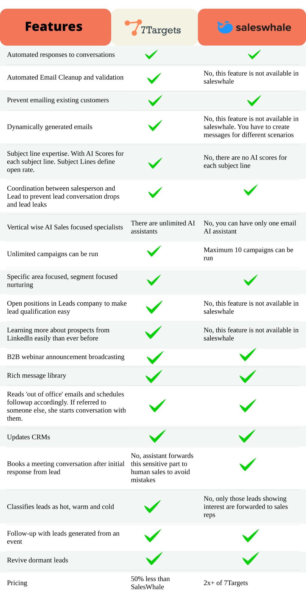

According to Gartner - the world's leading information technology research and advisory company, the market of conversational AI platforms (CAIP) is extremely diverse in terms of both vendor strategies and vendor targets. In such a market where nobody is majorly ahead of the pack, choosing the best fit as per your needs is essential for your business success. 

This diverse market has constraints like support for language variants and language. It is important for you to understand the level of support for needed languages and domain expertise is important to make a better choice. 

This market comprises 2000 global vendors. Hence, it is quite difficult to find out the best tool for automated follow-ups of your leads. Whereas lead nurturing with follow up boosts your lead conversion rate. Along with this, finding the best lead follow up email template is also critical. Because you don’t know what will work and what won’t.  

Confused? [Book a free consultation call with us](https://calendly.com/sanjuburkule/demo-7targets-ai-sales-assistant?month=2022-05)

We have researched the market and compared the CAIPs as per capabilities to make the following list of 10 best alternatives to Conversica, which is a popular one.

## 1. 7Targets AI Assistants

[7Targets](https://7targets.ai/cc-assistant-for-email-followup.html) is one of the best alternatives to Conversica and the AI assistants intelligently extract and take  ownership of all leads. It uploads excel files with Facebook leads, website leads, and event leads to your CRM.

As one of the best tools for automated follow-ups, it auto-generates human-like emails with the best follow-up template. The assistant also share success stories in the emails for nurturing the specific lead for follow-up email. 

In addition, the assistant reads the emails and responds to emails with various responses. For example, depending on the situation it asks for brochures and requests to connect later.

The 7Targets sales assistant informs you only the warm and hot leads by saving a lot of time for your sales reps. Moreover, it responds back to the prospects within minutes. The sales assistants can save up to 60% time of your sales reps.

Features of 7Targets sales assistants are: 

- It offers you pre-event registration. It helps build interest and drive leads to your presence in the booth at conferences, trade shows, webinars, demos, etc.
- It ensures you post-event engagement. It helps connect with the leads from an event to provide the details and get a qualified lead.
- 7Targets also activate your old contacts. By initiating communication with a prospect who has not been responding for a long time but showed some interest.
- This AI-sales assistant also nurtures unresponsive leads and revives old customers.
It accelerates your sales cycle by boosting the conversion rate.
- Most importantly - it takes care of the most important aspect of email marketing - lead nurturing with follow up.

Interested? [Get your 7 days Free Trial.](https://7targets.ai/emailcc-signup.html)

## 2. Verse.io

The Verse uses AI-driven and human-powered conversations to transform your leads into opportunities. Responding to leads and following up for lead nurturing are two major tasks of Verse. The multi-faceted lead response of Verse increases the lead conversion rate.

The Verse has recently developed a formula to decrease time spent transferring through subpar online leads. It helps the sales team with more time to focus on serious prospects and accelerate their conversion rate. 

Compatible with all lead types and CRMs, Verse auto funnels the leads the minute the assistant receives the same.

Verse offers a perfect blend of automation and human touch to vet every lead thoroughly. Your sales team gets full freedom with customized preferences, access to the real-time conversation, and all engagement data on your CRM.It’s a Sales Assistant with easier CRM integration.

The Verse assistant hands off the qualified lead to the sales team through live transfer or booked appointments. It just works as a smart extension of your team. 

## 3. Saleswhale
 

Saleswhale offers an AI-driven lead conversion system that helps you uncover pipelines that you have no idea about. It increases your lead conversion rate significantly. 

The AI assistant also helps your sales team to find out neglected leads. By enrolling leads from your CRM, Saleswhale helps you build powerful re-engagement workflows with integrations connectors. 

You can build your conversation playbook from pre-built use cases or from scratch.

The powerful built-in AI helps you to initiate and manage email conversations with thousands of leads with ease. 

Everything right from requests for content, referrals, OOO, DNC, etc. can be handled by the Saleswhale AI assistant. 

Whenever Saleswhale discovers that a lead wants human conversation, it assigns the same to the sales team asap. 

## 4. Exceed AI
 

It is a conversational marketing platform helping businesses drive extra pipelines from website visitors and emails. The AI Assistant of Exceed works 24*7*365 with humans to follow up, nurture, and qualify every lead with a two-way email conversation. 

The Exceed AI assistant can book a meeting directly on your sales rep’s calendar when a lead gets qualified. 

Moreover, it updates your marketing automation platform and CRM with the latest lead status. The auto-update parameters are qualified to lead, jobs changing, leaving the company, not the right person, or requesting to be contracted later. 

Features of Exceed AI are: 

- Inbound lead follow up with an immediate response
- Chatbot converts the website visitors into leads
- Verify and qualify leads (MQLs) before transferring the same into sales 
- Follow up the leads the sales touched but unresponsive 
- Activate cold leads on which prospects showed interest previously
- Reaching out to free users to find out whether they are ready to talk with a human rep 
- Reaching out to low-scoring leads.

## 5. Reply.io
 

This sales engagement platform enables you to scale and automate multichannel outreach to your prospects. Thus, it helps you generate more leads and revenue faster.

Reply offers a Google Chrome extension that helps you find verified emails on Sales Navigator. It also directly adds these to a list.

The AI assistant also engages all leaders with a combination of multi-channel approaches including, emails, calls, SMS, LinkedIn, and WhatsApp.

In addition, Reply enhances your emails with AI-supported scoring with an intelligent algorithm. It also finds out the sequence steps that work better.

You can also A/B test your messages before sending them to the prospects. With easy CRM integration, you can grow with connected data.

## 6. Salesrep.ai

Sales Rep AI sales assistant works closely with you to set up sequences based on your sales cycle. If you have never spoken to any lead also, this assistant creates the right sequence of steps.

In case you are following up from an old sales call and a separate one has started, you can add any kind of follow up process in the workflow of the assistant.

The assistant can also call your leads from local numbers on your behalf as per your requirements. Upon getting connected, the assistant can connect your sales reps to the prospect. 

If the prospect is unavailable, the assistant sends a voicemail or calls back later. The Salesrep assistant also sends SMS and emails from local numbers and personal accounts of your sales reps, respectively.

The built-in AI can act as per the behavior of the leads. For example, it can politely delay or stop a sequence, reschedule a call, and answer easy questions by saving your time.

Integrating the assistant with your CRM, the assistant keeps a track of every single lead in the CRM and sends notifications whenever the leads need your attention. 

## 7. Drift

Drift offers a live chat platform that helps you generate and qualify leads. Also, it sets meetings and is easy to integrate with your CRM platform.

It converts your website visitors into leads by booking direct meetings with the prospects. Integration with Calendly helps allow Drift AI assistants to book such meetings. 

These AI assistants have built-in machine learning capabilities by giving a new edge to the conversational marketing platform. 

Drift offers smart notifications, chat targeting, email playbooks, saved messages, dynamic routing, and contact activity history. 

The intuitive dashboards of Drift empower you to see performance metrics and interactions that are influencing your business. These dashboards show the number of meetings booked, leads received, and conversion rate.

In addition, you can view the productivity of your agent on Drift’s dashboard. 

## 8. Snov.io

Snov AI sales assistants help you reach your prospects with personalized campaigns with a high engagement rate. This virtual sales assistant helps you speed up your cold outreach and nurture your leads like a human.

In addition, you can schedule campaigns for your existing customers. The AI sales assistant also automatically follows up and tracks your email engagement from your Gmail inbox.

With 2000+ integration, Snov ensures you connect data for better efficiency and control. 
You can connect your account to your CRM and all your marketing apps and productivity tools.

## 9. Veloxy

Veloxy enables you to sell from your cell phones. And the virtual sales assistant lifts a heavy Salesforce load for you. It logs into Salesforce activity on auto-pilot. 

Additionally, it sends you active calendar and inbox alerts. Also helps to discover prospects based on geo-location. 

The Veloxy virtual sales assistants reduce your sales cycle and track emails. It sends CAN-SPAM compliant bulk email and also brings Salesforce to your inbox. 

The AI sales assistant gives you complete analysis and reporting on an interactive dashboard. With this, you can never lose leads and automate required activities by allowing your sales reps to focus on critical leads. 

## 10. Gmass
 

Gmass offers email services using a distributing technology. It merges your mail with Google sheets and reads live data. Meanwhile, it monitors the new rows and sends automatic emails to the respective prospects. 

The email reporting analytics give you a campaign level report, which shows the number of people who opened, clicked, and replied to the emails. You can see this both in your Gmail from your phone or desktop.  

Gmass also personalizes emails with auto-detecting of names where names are not available. It also takes the first and last name from your Google sheet to create personalized emails. 

It also saves your time and effort with automatic follow-up emails along with scheduling mass emails. Gmass also has a built-in email list builder along with proactive reply management. This helps you respond to the mass email with automatic categorization. 

For all of your email campaigns, it does manual follow-ups with prospects who have opened the email.  

## How to select the best CAIP?

You must understand the ROI on use cases to select the best CAIP vendor. Various CAIPs have various sweet spots and you can’t miss any of them while considering the best one for your business.

Not only in terms of costs, but you need to also check the competence and time investment. The basic purposes of CAIP are: 

- **Replacing humans:** The primary purpose of CAIP is to replace humans and to cut the costs of salary with less employees. 
- **Empowering humans:** Another purpose is to empower your team and allow them enough time to focus on conversion by automating redundant tasks. With this, your team can make better business decisions, democratize access, and ensure compliance.
- **Growth and innovation:** Facilitating growth by holding a conversation and nurturing leads is one of the prime purposes of CAIP.

Need more strategic insights? [We are ready to help now](https://calendly.com/sanjuburkule/demo-7targets-ai-sales-assistant?month=2022-05)

Common use cases of CAIP are:

- **Customers:** Most businesses use CAIP for customer services in B2B scenarios. This audience uses phonetic spelling and shorthands for describing their requirements for products and services.
- **Employees:** Many businesses use conversational solutions to support their employees. Here the language of the audience can be quite specialized, uniform, and comprises internal abbreviations.
- **Consumers:** Consumers, typically are the end-user of your retail products. They use such platforms to search and know more about products.

A CAIP platform can be:

- Standalone
- Part of a cognitive platform 
- Unit of an enterprise platform

What is your requirement? [Let us know](https://calendly.com/sanjuburkule/demo-7targets-ai-sales-assistant?month=2022-05)

Meanwhile, the CAIP vendors typically package the AI assistants as part of:

- **Platform:** A low-code/no-code platform with accelerators and pre-build components.
- **Product:** Specific for a specific industry or domain with less alternative use cases. 
- **Project:** Such CAIP are built on the top of a product or a platform. It can ensure you a finished solution. 

## Gartner’s recommendations

- Constraint your selection of vendors based on your requirement for the next two years with expected ROI and success.
- Use the 7 high levels of categories that decide the major differentiator in the market and select the vendors as per your requirements. 
- Make sure that the vendor you select offers robust support of the target language by aligning their NLP capabilities.

## Impact of COVID-19 on CAIP Market

Following the COVID-19 pandemic breakout, the conversational AI market exploded. During this time, the amount of customer assistance queries via websites and apps increased dramatically. 

However, a shortage of working workers and constraints on customer service centers imposed a significant burden on human customer service representatives, significantly impacting the customer experience.

As a result, businesses immediately moved to conversational AI to handle the growing number of service requests and provide prompt solutions.

Want business continuity with the best conversational AI? [Book a demo](https://calendly.com/sanjuburkule/demo-7targets-ai-sales-assistant?month=2022-05)

## Our solution approach

As one of the best alternatives to Conversica, we design our AI Sales Assistants as per your requirement. Our team creates AI Sales Assistants who analyze every response from every lead using Natural Language Processing (NLP). They understand terms such as ‘next week,’ ‘next quarter,’ ‘after six months’, and so on.

7Target’s sales assistants automate all of your mundane tasks including lead engagement, lead nurturing, lead classification, lead follow-ups, ooo follow-ups, etc. By automating such repetitive tasks, we allot more time to your sales reps so that they can focus on conversion. Our sales assistants empower your sales team with automation and fast responses to every lead.

In addition, you can easily integrate our sales assistants with your CRM and it updates data from it in minutes by giving you a clear view of your sales funnel.

[Book a meeting with us](https://calendly.com/sanjuburkule/demo-7targets-ai-sales-assistant?month=2022-05)

## How to nurture leads with follow-ups?

Look at our follow up model:
 

