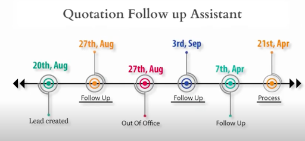

### Understanding the Email CC Feature

#### What is the Email CC Feature?

The **Email CC feature** is a game-changer offered by **7Targets AI Assistants**. It allows users to effortlessly include the AI assistant in their email communications. By simply CCing the assistant, you can automate follow-ups and ensure that no lead slips through the cracks.

This feature is designed to enhance your email strategy, making it easier to manage leads and improve response rates. Imagine having an assistant that works tirelessly to follow up on your behalf. That's exactly what the Email CC feature provides.  

#### How the Email CC Feature Works

1. **CC the Assistant:** When you compose an email, simply add the AI assistant to the CC field. This action triggers the automation process.  
     
2. **Automated Follow-ups:** Once CCed, the assistant takes charge of the follow-up process. It reaches out to leads as necessary, ensuring timely communication.  
     
3. **Response Management:** The assistant automatically halts follow-ups once a lead responds. This feature ensures that your communication remains efficient and relevant.

### Benefits of Using the Email CC Feature

#### Increased Response Rates

One of the standout benefits of the Email CC feature is its ability to significantly boost response rates. For example, **Shreeji Pharma** saw an impressive **68% growth** in responses after implementing the AI Assistant's follow-up capabilities. This remarkable increase positioned them as the top performer in their group, surpassing all other human efforts combined.

#### Automated Follow-ups for Efficiency

The **AI Sales Assistant** streamlines the follow-up process, allowing sales teams to concentrate on closing deals rather than chasing leads. This automation not only saves valuable time but also ensures that leads receive timely communication. As a result, the chances of conversion are greatly enhanced.

    <iframe src="https://www.youtube.com/embed/l62KcYAxHik" height="380" width="560" 
    allow="autoplay; encrypted-media"
    frameborder="0">
    </iframe>

**Shreeji Pharma** gets leads from various sources like IndiaMart and social media. If a lead does not close, they used to drop the lead from their funnel. With AI Assistant, if a lead does not close, he continues to get nurtured about once a month (configurable). In **Shreeji Pharma** case, nurturing is about sharing this months pricing of different Pharma products. A lead, who once is in the system, can always consider coming back after looking at the prices. 

Meaningful followups are more important than normal followups. This is a good example of that. 

### Managing Lead Responsiveness with AI Sales Assistant

#### Identifying LEAD\_AT\_RISK

The AI Assistant is equipped to monitor lead responsiveness effectively. If a lead is responsive but the internal salesperson is not, the assistant flags the lead as **LEAD\_AT\_RISK**. This proactive approach ensures that no potential opportunity is overlooked.

#### Continuous Internal Follow-ups

The assistant continues to follow up internally until the lead is responded to. This feature keeps the sales team engaged and informed about the status of their leads. Maintaining momentum in the sales process is crucial, and this capability ensures that no lead is left unattended.

### Real-World Success Stories

#### Case Study: Shreeji Pharma

Shreeji Pharma's success story exemplifies the effectiveness of the Email CC feature. By leveraging the AI Assistant for follow-ups, they not only increased their response rates but also improved their overall sales performance. Their journey showcases how the Email CC feature can transform email strategies and drive results.

### Best Practices for Maximizing the Email CC Feature

#### Tips for Effective Email Communication

- **Be Clear and Concise:** Ensure your emails are straightforward and to the point. Clarity is key to effective communication.  
    
- **Set Expectations:** Let leads know what they can expect in terms of follow-ups. This transparency builds trust.  
    
- **Utilize Personalization:** Personalize your emails to enhance engagement. Tailored messages resonate better with recipients.

Another example: Cc Assistants for Quotation followups  

#### Leveraging AI Sales Assistant for Better Results

Integrating the **AI Sales Assistant** into your daily workflows can significantly enhance sales outcomes. Here are some practical tips:

- **Regularly CC the Assistant:** Make it a habit to include the assistant in relevant communications. This consistency will yield better results.  
    
- **Monitor Performance:** Keep track of response rates and adjust strategies as needed. Continuous improvement is essential for success.

### Conclusion: Transform Your Email Strategy Today

#### Take Action with the Email CC Feature

The Email CC feature and **AI Sales Assistant** can revolutionize your email follow-up strategy. By automating follow-ups and managing lead responsiveness, you can significantly boost your sales performance.

Are you ready to experience the benefits for yourself? **[Click here for a Free Trial](https://followup.7targets.com)** and see how quickly you can enhance your email strategy!

For more information about **7Targets** and our innovative solutions, visit [7Targets.ai](https://7Targets.ai).

