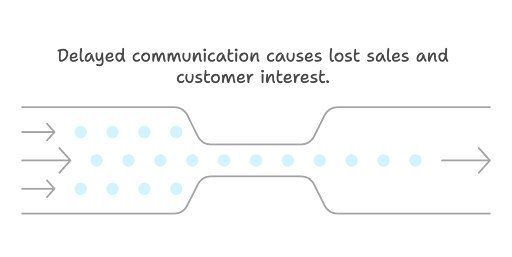
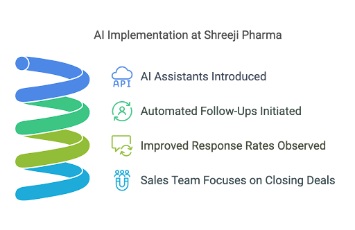
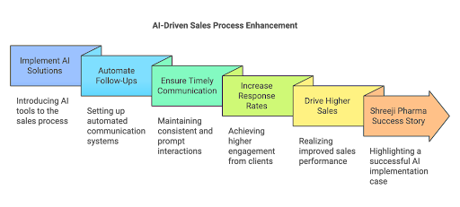

In today's fast-paced business environment, many leads drop off simply because follow-ups are missed. This is where 7Targets comes into play. By leveraging AI follow-up strategies, businesses can ensure timely and consistent follow-ups, significantly increasing response rates. With real-world success stories like Shreeji Pharma, companies can witness tangible ROI through AI-driven persistence.

In this blog post, we will explore the importance of AI follow-ups, delve into a case study of Shreeji Pharma, and provide actionable steps for implementing automated follow-ups in your own sales process.

So, how can AI follow-up solutions transform your sales strategy? Let’s dive in\!

---

## Maximize Your Leads with AI Follow-Up

### Understanding the Importance of Follow-Ups

Follow-ups are a critical component of the sales process. They serve as a reminder to potential customers about your product or service. Without effective follow-ups, leads can easily slip through the cracks.

Did you know that a significant percentage of sales are lost due to missed follow-ups? This is a common challenge faced by many businesses. When potential customers don’t receive timely communication, they may lose interest or turn to competitors.

AI follow-up solutions can help mitigate this issue. By automating follow-ups, businesses can ensure that no lead is left unattended. This not only improves customer engagement but also enhances the overall sales process.  

Incorporating AI-driven follow-ups can lead to a more organized approach to sales. It allows sales teams to focus on closing deals rather than worrying about whether they’ve followed up with every lead.

---

### How AI Follow-Up Works

AI follow-up systems utilize advanced algorithms to track leads and schedule follow-up communications. These systems can analyze customer behavior and engagement patterns, allowing for personalized follow-up messages.

Imagine a scenario where a potential customer visits your website but doesn’t make a purchase. An AI follow-up system can automatically send a reminder email or message, encouraging them to return. This level of automation ensures that your leads are consistently nurtured.

Moreover, AI follow-up solutions can prioritize leads based on their engagement levels. This means that your sales team can focus on the most promising leads first, maximizing their chances of conversion.

By integrating AI into your follow-up strategy, you can create a seamless experience for your customers. They receive timely reminders and personalized messages, which can significantly enhance their overall experience with your brand.

---

## Real-World Success: Shreeji Pharma's Journey

### The Challenge of Missed Follow-Ups

Shreeji Pharma faced a common challenge: missed follow-ups. Despite having a robust sales team, they struggled to keep track of leads and ensure timely communication. This led to a significant drop in response rates and ultimately affected their bottom line.

The sales team was overwhelmed with the volume of leads, making it difficult to maintain consistent follow-ups. As a result, many potential customers lost interest or chose to engage with competitors who provided more timely communication.

Recognizing this challenge, Shreeji Pharma sought a solution that would streamline their follow-up process. They needed a system that could automate follow-ups while still allowing for personalized communication.

---

### Implementing AI Assistants for Consistency

To address their challenges, Shreeji Pharma implemented AI assistants from 7Targets. These AI-driven tools ensured that follow-ups were timely and consistent.

The implementation process was straightforward. The AI assistants were integrated into their existing CRM system, allowing for seamless tracking of leads and follow-up communications.

Once the AI assistants were in place, Shreeji Pharma saw a remarkable improvement in their response rates. The automated follow-ups ensured that no lead was left unattended, and the sales team could focus on closing deals rather than managing follow-up schedules.  

This shift not only improved their sales process but also enhanced customer satisfaction. Customers appreciated the timely reminders and personalized messages, leading to increased engagement and conversions.

---

## The Benefits of Automated Follow-Ups

### Increased Response Rates

One of the most significant benefits of automated follow-ups is the increase in response rates. When potential customers receive timely reminders, they are more likely to engage with your brand.

Shreeji Pharma experienced this firsthand. After implementing AI follow-up solutions, their response rates skyrocketed. The consistent communication kept potential customers engaged and interested in their products.

Automated follow-ups also allow businesses to reach out to leads at optimal times. By analyzing customer behavior, AI systems can determine the best times to send follow-up messages, further increasing the likelihood of a response.

---

### Real ROI Through AI-Driven Persistence

The return on investment (ROI) from AI-driven follow-ups can be substantial. Shreeji Pharma not only saw an increase in response rates but also a significant boost in sales.

By automating their follow-up process, they were able to convert more leads into customers. This translated into higher revenue and a more efficient sales process.

Investing in AI follow-up solutions is not just about improving response rates; it’s about creating a sustainable sales strategy that drives long-term growth.

---

## Getting Started with AI Follow-Up Solutions

### Choosing the Right AI Assistant

When considering AI follow-up solutions, it’s essential to choose the right AI assistant for your business. Look for a system that integrates seamlessly with your existing tools and offers customizable features.

7Targets provides a range of AI assistants designed to meet the needs of various businesses. Whether you’re a small startup or a large corporation, there’s an AI solution that can enhance your follow-up process.

Consider factors such as ease of use, scalability, and customer support when selecting an AI assistant. The right choice can make a significant difference in your sales process.

---

### Best Practices for Effective Follow-Ups

To maximize the effectiveness of your AI follow-up strategy, consider implementing the following best practices:

1. **Personalize Your Messages:** Tailor your follow-up communications to each lead. Use their name and reference their previous interactions with your brand.  
     
2. **Timing is Key:** Use AI to determine the best times to send follow-up messages. This can significantly increase the chances of a response.  
     
3. **Be Consistent:** Ensure that follow-ups are sent consistently. Automated follow-ups can help maintain this consistency without overwhelming your sales team.  
     
4. **Track Engagement:** Monitor how leads respond to your follow-up messages. This data can provide valuable insights into what works and what doesn’t.

By following these best practices, you can create a robust AI follow-up strategy that drives results.

---

## Transform Your Sales Process Today

### Key Takeaways

AI follow-up solutions can revolutionize your sales process. By automating follow-ups, you can ensure timely communication, increase response rates, and ultimately drive higher sales.

Real-world success stories, like that of Shreeji Pharma, demonstrate the tangible benefits of implementing AI-driven persistence.  
  
---

### Next Steps for Implementation

Are you ready to transform your sales process with AI follow-up solutions? Start by exploring the options available from 7Targets.

[Sign up](https://followup.7targets.com) for a free trial today and experience the benefits of automated follow-ups for yourself. In just a few minutes, you can set up a system that enhances your sales strategy and drives results.