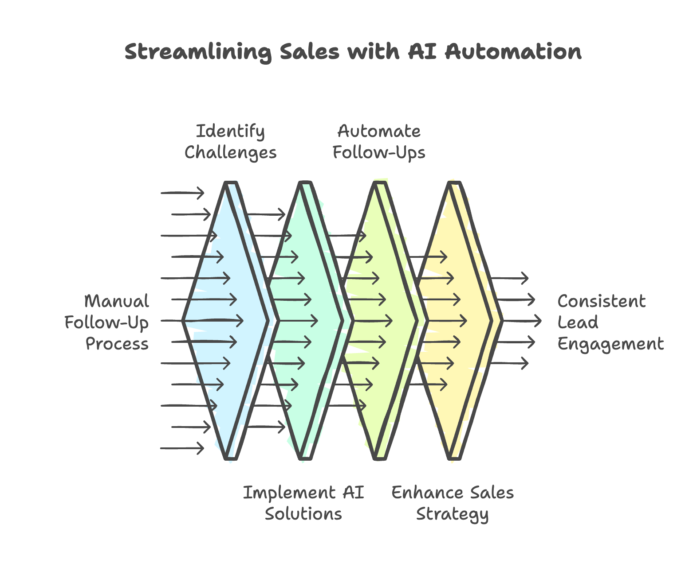

In the fast-paced world of sales, every interaction counts. Did you know that studies indicate a staggering 85% of lost sales stem from inconsistent follow-ups? This statistic highlights a critical issue that many businesses face.

At 7Targets, we understand the challenges of maintaining consistent communication with leads. Manual follow-ups can be tedious and often lead to human error. Fortunately, AI-driven assistants are here to change the game. They automate the follow-up process, ensuring that no lead is left behind and that follow-ups occur at precisely the right time.

In this blog post, we will explore the importance of automating follow-ups, the challenges of manual processes, and how AI sales automation can help you streamline your sales efforts. By the end, you’ll have a comprehensive understanding of how to prevent missed follow-ups and enhance your sales strategy.

---

## Understanding Missed Follow-Ups

### The Impact of Missed Follow-Ups

Missed follow-ups can have a profound impact on your sales performance. When potential customers don’t receive timely communication, they may feel neglected or undervalued. This can lead to lost opportunities and ultimately affect your bottom line.

Imagine a scenario where a lead expresses interest in your product but never hears back from you. They might turn to a competitor who is more responsive. This is a common occurrence in the sales world, and it underscores the importance of consistent follow-up.

Moreover, missed follow-ups can damage your brand reputation. Customers expect timely responses, and failing to meet these expectations can lead to negative perceptions of your business.

By understanding the impact of missed follow-ups, you can take proactive steps to ensure that your leads receive the attention they deserve.

### Statistics on Sales Losses

The statistics surrounding sales losses due to missed follow-ups are alarming. Research shows that a significant percentage of leads never convert into customers simply because they were not followed up with in a timely manner.

For instance, a study revealed that businesses that follow up with leads within the first hour are seven times more likely to qualify that lead than those who wait even an hour longer. This statistic emphasizes the urgency of timely follow-ups.

Additionally, companies that implement follow-up automation report a marked increase in conversion rates. By automating follow-ups, businesses can ensure that they are consistently engaging with leads, ultimately leading to higher sales and improved customer satisfaction.

---

## The Challenges of Manual Follow-Ups

### Tedious Nature of Manual Processes

Manual follow-ups can be incredibly tedious. Sales teams often juggle multiple leads, making it challenging to keep track of who needs to be contacted and when. This can lead to confusion and, ultimately, missed opportunities.

The repetitive nature of manual follow-ups can also lead to burnout among sales representatives. When team members are bogged down by administrative tasks, they have less time to focus on building relationships with potential customers.

Furthermore, the lack of organization in manual processes can result in inconsistent communication. Some leads may receive timely follow-ups, while others may fall through the cracks. This inconsistency can hinder your sales efforts and lead to lost revenue.

### Human Error in Follow-Ups

Human error is another significant challenge associated with manual follow-ups. Sales representatives are only human, and mistakes can happen. A missed email, a forgotten call, or a miscommunication can all lead to missed opportunities.

In fact, studies show that human error is one of the leading causes of lost sales. When follow-ups are left to chance, the likelihood of mistakes increases. This can be detrimental to your sales process and can result in lost leads.

By automating follow-ups, you can significantly reduce the risk of human error. AI-driven assistants can ensure that every lead is contacted at the right time, eliminating the potential for mistakes.

---

## How AI Sales Automation Can Help

### Benefits of AI-Driven Assistants

AI sales automation offers numerous benefits that can transform your follow-up process. One of the most significant advantages is the ability to automate repetitive tasks. This frees up your sales team to focus on what they do best: building relationships with customers.

AI-driven assistants can also analyze data and provide insights into customer behavior. This allows you to tailor your follow-up strategies based on individual preferences and needs. By understanding your leads better, you can increase the likelihood of conversion.

Moreover, AI sales automation ensures that no lead is left behind. With automated follow-ups, you can rest assured that every potential customer receives timely communication. This consistency can lead to improved customer satisfaction and loyalty.

### Ensuring Timely Follow-Ups

Timeliness is crucial in the sales process. AI sales automation ensures that follow-ups happen at the right time, maximizing your chances of conversion.

For example, AI-driven systems can schedule follow-up emails or calls based on lead behavior. If a lead opens an email but doesn’t respond, the system can automatically trigger a follow-up message. This proactive approach keeps your business top-of-mind for potential customers.

Additionally, AI can help prioritize leads based on their engagement levels. By focusing on the most promising leads, your sales team can allocate their time and resources more effectively.

---

## Implementing AI Sales Automation

### Choosing the Right AI Tools

When it comes to implementing AI sales automation, choosing the right tools is essential. There are numerous options available, each with its own features and capabilities.

Start by assessing your specific needs. What challenges are you facing with your current follow-up process? Are you looking for a tool that integrates with your existing CRM system? Understanding your requirements will help you narrow down your options.

Additionally, consider the scalability of the AI tools you choose. As your business grows, your automation needs may change. Opt for solutions that can adapt to your evolving requirements.

### Best Practices for Automation

Once you’ve chosen the right AI tools, it’s important to implement best practices for automation. Start by setting clear goals for your follow-up process. What do you hope to achieve through automation?

Next, ensure that your team is trained on how to use the AI tools effectively. This will help maximize the benefits of automation and ensure a smooth transition.

Finally, regularly review and adjust your automation strategies based on performance data. This will help you identify areas for improvement and optimize your follow-up process over time.

---

## Measuring Success After Automation

### Key Metrics to Track

After implementing AI sales automation, it’s crucial to measure your success. Key metrics to track include conversion rates, response times, and overall sales performance.

By analyzing these metrics, you can gain insights into the effectiveness of your follow-up strategies. Are your automated follow-ups leading to higher conversion rates? Are leads responding more quickly?

Additionally, consider tracking customer satisfaction scores. Automated follow-ups can enhance the customer experience, and measuring satisfaction can help you gauge the impact of your efforts.

### Adjusting Strategies Based on Data

Data-driven decision-making is essential for continuous improvement. Use the insights gained from your metrics to adjust your follow-up strategies as needed.

For example, if you notice that certain types of follow-ups yield better results, consider focusing more on those approaches. Conversely, if a particular strategy isn’t working, don’t hesitate to pivot and try something new.

By regularly reviewing your data and adjusting your strategies, you can ensure that your follow-up process remains effective and aligned with your business goals.

---

## Real-World Examples of AI Sales Automation

### Case Studies

Many businesses have successfully implemented AI sales automation to enhance their follow-up processes. For instance, a leading software company saw a 30% increase in conversion rates after automating their follow-ups.

By using AI-driven tools, they were able to ensure that every lead received timely communication. This consistency led to improved customer engagement and ultimately higher sales.

### Success Stories

Another success story comes from a retail company that struggled with missed follow-ups. After implementing AI sales automation, they reported a significant reduction in missed leads.

The automated system allowed them to prioritize follow-ups based on customer behavior, ensuring that no lead was overlooked. As a result, they experienced a boost in customer satisfaction and loyalty.

These real-world examples demonstrate the tangible benefits of AI sales automation in preventing missed follow-ups.

---

## Taking Action to Prevent Missed Follow-Ups

### Steps to Get Started

Ready to take action? Here are some steps to get started with AI sales automation:

1. **Assess Your Needs:** Identify the challenges you face with manual follow-ups.  
2. **Research AI Tools:** Explore different AI sales automation tools that align with your requirements.  
3. **Set Clear Goals:** Define what you hope to achieve through automation.  
4. **Train Your Team:** Ensure that your sales team is equipped to use the new tools effectively.  
5. **Monitor Performance:** Regularly track key metrics to measure success and make adjustments as needed.

By following these steps, you can set your business up for success and prevent missed follow-ups.

### Final Thoughts on Automation

In conclusion, missed follow-ups can have a significant impact on your sales performance. However, with the help of AI sales automation, you can streamline your follow-up process and ensure that no lead is left behind.

At 7Targets, we believe in the power of automation to enhance sales strategies. By implementing AI-driven tools, you can improve customer engagement, increase conversion rates, and ultimately drive revenue growth.

Don’t let missed follow-ups hold your business back. Take action today and explore the benefits of AI sales automation.
